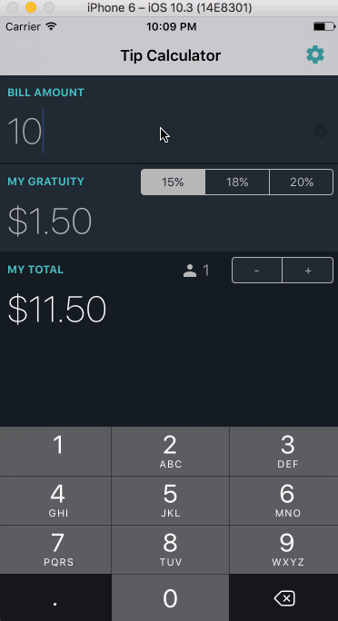

# Pre-work - *TipCalculator*

**TipCalculator** is a tip calculator application for iOS.

Submitted by: **Varun Kochar**

Time spent: **10** hours spent in total

## User Stories

The following **required** functionality is complete:

* [x] User can enter a bill amount, choose a tip percentage, and see the tip and total values.
* [x] Settings page to change the default tip percentage.

The following **optional** features are implemented:
* [x] UI animations
* [x] Remembering the bill amount across app restarts (if <10mins)
* [x] Using locale-specific currency and currency thousands separators.
* [x] Making sure the keyboard is always visible and the bill amount is always the first responder. This way the user doesn't have to tap anywhere to use this app. Just launch the app and start typing.

The following **additional** features are implemented:

- [x] Split the bill and the tip between a specified number of people.

## Video Walkthrough 

Here's a walkthrough of implemented user stories:

GIF created with [LiceCap](http://www.cockos.com/licecap/).

## Project Analysis

As part of your pre-work submission, please reflect on the app and answer the following questions below:

**Question 1**: "What are your reactions to the iOS app development platform so far? How would you describe outlets and actions to another developer? Bonus: any idea how they are being implemented under the hood? (It might give you some ideas if you right-click on the Storyboard and click Open As->Source Code")

**Answer:** Xcode is easy to start with. With no additional setup needed, anyone can quickly jump into iOS programming. Outlets are handles/references to the view defined in the storyboard. Actions are like callbacks that get invoked when the view in being operated upon (for ex: Text being typed in an UITextField, or a button being clicked/tapped). Outlets and Actions are defined as XML tags, with eventType, destination and the targe method to be invoked.

Question 2: "Swift uses [Automatic Reference Counting](https://developer.apple.com/library/content/documentation/Swift/Conceptual/Swift_Programming_Language/AutomaticReferenceCounting.html#//apple_ref/doc/uid/TP40014097-CH20-ID49) (ARC), which is not a garbage collector, to manage memory. Can you explain how you can get a strong reference cycle for closures? (There's a section explaining this concept in the link, how would you summarize as simply as possible?)"

**Answer:** This is much similar to anonymous classes in java which capture the enclosing class. When a closure which is a property of a class instance, refers to another property of the instance, it is also keeping a strong reference to the instance itself. In this case, the closure holds a strong reference of the instance by capturing it, and the instance holds a strong reference to the closue, since the closure is a property of the instance.

## License
MIT
